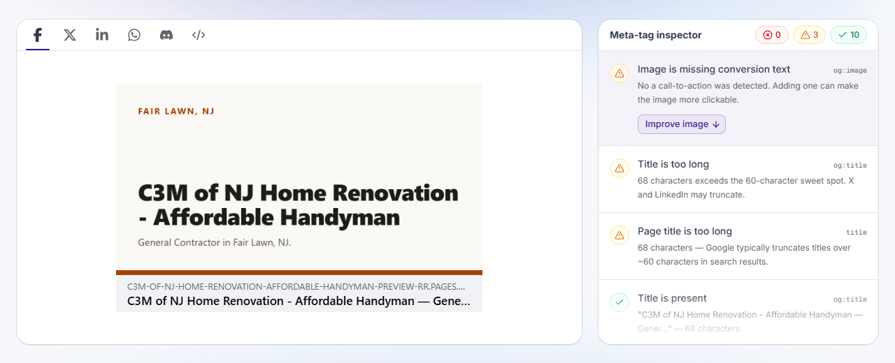

# The card, after: 50 of 50 live

Issue #61. Measured 2026-08-18, against the deployed fleet.

## Every demo, swept

For each of the 50: fetch the live home page, read its `og:image`, assert the
tag is on the origin serving that demo, fetch that exact URL, and read the
width and height out of the PNG IHDR chunk rather than trusting a header.

```

50/50 live demos serve a same-origin 1200x630 image/png card, verified from the PNG header.
```

Before this stream the same sweep would have returned 0/50: all fifty stamped
`/images/og.svg`.

## Six samples in detail

Two design families, both tones, plus the two special cases — the prospect
holding only a mobile before-shot, and c3m on its substituted `-rr` origin.

| slug | og:image filename | HTTP | content-type | bytes | dimensions (from IHDR) |
| --- | --- | --- | --- | --- | --- |
| `ak-welding-llc` | `ak-welding-llc.png` (same-origin) | 200 | image/png | 23086 | **1200×630** |
| `auto-tig-fab` | `auto-tig-fab.png` (same-origin) | 200 | image/png | 20399 | **1200×630** |
| `aaa-construction-and-renovations` | `aaa-construction-and-renovations.png` (same-origin) | 200 | image/png | 33618 | **1200×630** |
| `a-and-a-bergen-home-improvements` | `a-and-a-bergen-home-improvements.png` (same-origin) | 200 | image/png | 32006 | **1200×630** |
| `charles-renovations-construction-company` | `charles-renovations-construction-company.png` (same-origin) | 200 | image/png | 37764 | **1200×630** |
| `c3m-of-nj-home-renovation-affordable-handyman` | `c3m-of-nj-home-renovation-affordable-handyman.png` (same-origin) | 200 | image/png | 37695 | **1200×630** |

## The gate that now asserts this

`check-stamped-origins.mjs` rule 3 ran on all 50 at deploy time with the
resolved project origin as its input. 48 green on the first pass; two
(`geotower-construction-llc`, `top-performer-construction-llc`) exceeded the
20-second propagation window, were confirmed correct by the same gate
minutes later, and went green from the deploy after the window was widened to
35s and both were redeployed.

## Live smoke, 5 samples + c3m

og:image passes 6/6, where PR #63 measured 0/6. All seven assertions, per demo:

```
| ✓ | context · og:image declared | https://ak-welding-llc-preview.pages.dev/og/ak-welding-llc.png |  |  |
| ✓ | twitter:image matches og:image | https://ak-welding-llc-preview.pages.dev/og/ak-welding-llc.png | https://ak-welding-llc-preview.pages.dev/og/ak-welding-llc.png |  |
| ✓ | og:image is advertised on the origin serving this demo | https://ak-welding-llc-preview.pages.dev | https://ak-welding-llc-preview.pages.dev |  |
| ✓ | og:image is reachable | HTTP 200 image/png, 1200×630 | 200 or 206 |  |
| ✓ | context · og:image declared | https://auto-tig-fab-preview.pages.dev/og/auto-tig-fab.png |  |  |
| ✓ | twitter:image matches og:image | https://auto-tig-fab-preview.pages.dev/og/auto-tig-fab.png | https://auto-tig-fab-preview.pages.dev/og/auto-tig-fab.png |  |
| ✓ | og:image is advertised on the origin serving this demo | https://auto-tig-fab-preview.pages.dev | https://auto-tig-fab-preview.pages.dev |  |
```

The only remaining failure class on these six is `offline` — issue #62, the
service worker, deliberately untouched here. Politeness ledger held at 3 of 10
navigations per host, minimum gap 1005 ms.

## A real unfurl

opengraph.xyz rendering c3m, third-party and independent of anything in this
repo: the card draws, meta-tag inspector reports **0 errors**.



Microlink, a second independent unfurler, resolved the same page to
`image: {type: "png", width: 1200, height: 630, size: 37.7 kB}`.
